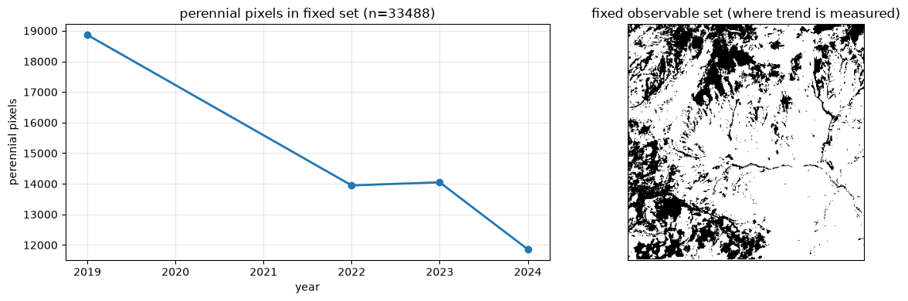
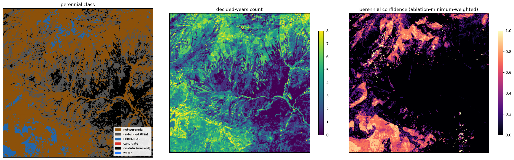

# Beas Kund Perennial Snow

Multi-sensor mapping of **perennial snow and ice** — surface that survives the late-summer ablation
minimum across multiple years — over the **Beas Kund cirque**, Himachal Pradesh, from Sentinel-2 and
Landsat 8/9 (2017–2024). Cross-validated against an operational European snow product (Theia LIS),
Cohen's kappa **0.86** at the definitional perennial threshold, stable 0.83–0.87 across thresholds.

This project is self contained but feeds another project for avalanche detection where land cover is a 
required factor and perennial snow can act as a separate land cover layer for the incoming fresh snow.

---

## What it does

- Classifies every clear satellite look as snow / not-snow by **NDSI**, with MODIS/VIIRS-ATBD
  reflectance screens applied before the index.
- Fuses **three sensors** (Sentinel-2, Landsat 8, Landsat 9) as independent per-acquisition units on a
  shared 30 m grid, so independent clear-sky days fill each other's cloud gaps.
- Reduces each year to a noise-tolerant **per-year verdict**, then combines years into a **perennial
  mask** with an explicit reason for every pixel (perennial / not-perennial / undecided / no-data / water).
- Measures **interannual change** on a fixed observable pixel set (change on the *same ground* every
  year, not sampling drift).

## Key results

- **Perennial mask**, 2017–2024, nadir-weighted, with a full honesty layer (decided-years count,
  per-pixel confidence, and a reason for every non-verdict pixel).
  
- **Interannual change** (2019, 2022, 2023, 2024) on the ~25% of the AOI reliably observed in all four
  years — reported as a trend on that observable subset, explicitly not basin-wide.
  
- **Validation** against the Theia Sentinel-2 Snow Cover Yearly Synthesis (LIS SCD) over Mont Blanc:
  Cohen's kappa **0.86** at the definitional threshold (SCD ≥ 360 days), stable 0.83–0.87, high
  precision throughout. Every disagreement pixel is accounted for: the method additionally maps
  glacier tongues that Theia excludes via its DEM snowline gate, and is slightly more conservative on
  shadowed north-facing slopes.
  


---

## Method (short)

| Stage | What |
|-------|------|
| 1 | Search all sensors' late-summer window; each (tile, date, sensor) acquisition is its own unit |
| 2 | Per-acquisition cloud gating over each acquisition's own footprint |
| 3 | Classify + cache each look: NDSI with ATBD reflectance screens; NDSI overrides cloud on snow |
| 4 | Per-year verdict from the yearly snow fraction (bare is a yearly aggregate, never a per-epoch veto) |
| 5 | Multi-year persistence → perennial mask, with asymmetric evidence and an explicit no-data/water/undecided split |
| 6 | Visualize |
| 7 | Interannual change on a fixed observable intersection |

The full rationale for every non-obvious choice — including the approaches tried and abandoned — is in
[`DECISIONS.md`](DECISIONS.md). The formal methodology and citations are in [`METHODS.md`](METHODS.md).

---

## Repository layout

```
beas-kund-perennial-snow/
├── README.md
├── DECISIONS.md                          # every design choice + why (and what was rejected)
├── METHODS.md                            # formal methodology + citations
├── requirements.txt
├── notebooks/
│   ├── perennial_snow_beas_kund.ipynb    # the study (Beas Kund)
│   └── validation_mont_blanc.ipynb       # cross-validation vs Theia LIS SCD
└── figures/
```

## Running it

**Requirements.** Python 3.12, a Microsoft Planetary Computer connection (no key needed for the STAC
catalog used here). For the validation only, a hydroweb.next / Theia account and API key are needed to
download the reference product.

```bash
pip install -r requirements.txt
```

**Study.** Open `notebooks/perennial_snow_beas_kund.ipynb` and run top to bottom. Stage 3 fetches and
classifies imagery once and caches it to disk; every later run reuses the cache and is offline.

**Validation.** The pipeline is AOI-agnostic — the validation runs the same pipeline over a Mont Blanc
config (bbox `[6.80,45.80,7.05,45.95]`, `UTM=EPSG:32632`, Alpine September window), then
`notebooks/validation_mont_blanc.ipynb` compares the result to the Theia LIS SCD product.
Set your Theia key in the environment first:

```bash
export HYDROWEB_API_KEY=...
```

---

## Data & attribution

- **Sentinel-2 L2A, Landsat C2 L2** — via Microsoft Planetary Computer.
- **Copernicus GLO-30 DEM** — via Planetary Computer (used in the validation disagreement analysis).
- **Theia Sentinel-2 Snow Cover Yearly Synthesis (LIS L3B)** — CNES / hydroweb.next, ETALAB 2.0 license
  (validation reference).

## Scope & honesty notes

- The interannual-change trend is measured on the reliably-observed subset (~25% of the AOI), **not**
  basin-wide; observation is uneven (cloud, terrain shadow, sensor gaps). No aspect-differentiated
  melt claim is made.
- The nadir-recency confidence weighting is a phenology-grounded **heuristic**, not a derived formula.
- Thresholds are tuned for these AOIs; wide-area / operational use would need re-grounding
  (see the localisation notes in `DECISIONS.md`).

## License

MIT license: [`LICENSE`](LICENSE)
